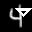
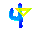
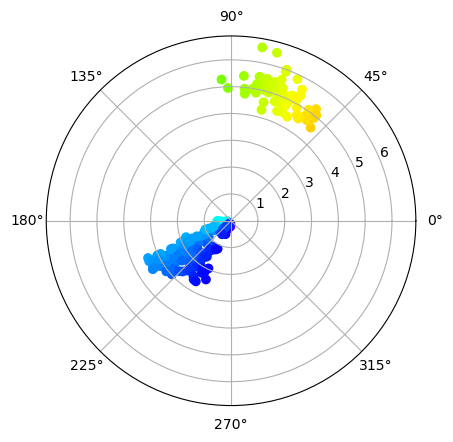
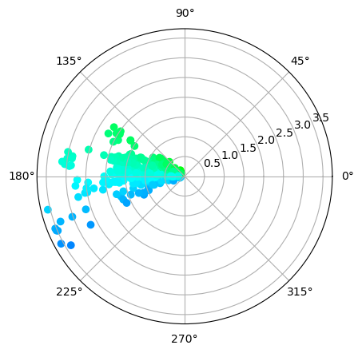
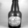
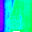
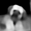

# Progress - January 23th
Complex Valued Autoencoders for Object Discovery

---
### Restructure of Framework
- Existing codebase
    - Functional approach
    - Nested configurations
- New structure
    - Modular approach
    - Per-module configuration
    - More compatible with PyTorch
- Room for other complex-valued modules

---
### MNIST & Shape
|  |  |  |
| :---: | :---: | :---: |
| Sample | Reconstruction |Phases |

---
### MNIST & Shape
|  |  |  |
| :---: | :---: | :---: |
| Sample | Phases | Polar |

---
### CIFAR100 Example 1
|  |  |  |
| :---: | :---: | :---: |
| Sample | Reconstruction | Phases |

---
### CIFAR100 Example 1
|  |  |  |
| :---: | :---: | :---: |
| Sample | Phases | Polar |

---
### CIFAR100 Example 2
|  |  |  |
| :---: | :---: | :---: |
| Sample | Reconstruction | Phases |

---
### CIFAR100 Example 2
|  |  |  |
| :---: | :---: | :---: |
| Sample | Phases | Polar |

---
### ImageNet
|  |  |  |
| :---: | :---: | :---: |
| Sample | Reconstruction | Phases |

---
### ImageNet
|  |  |  |
| :---: | :---: | :---: |
| Sample | Phases | Polar |

---
### Challenges
- Poor reconstruction quality
    :heavy_check_mark: Larger model
    :heavy_check_mark: Larger images (ImageNet)
    &nbsp;&nbsp;&nbsp;&nbsp; ↳ More phase assignments ⟶ Less separability
- Poor phase assignments (Unseparability)
    :heavy_multiplication_x: Contrastive learning
- RGB seperation
    :heavy_multiplication_x: New evaluation of complex output

---
### Literature

- **DetCo**: Unsupervised Contrastive Learning
- **DINO** Emerging Properties in Self-Supervised ViT
- **PatchNet**: Unsupervised Object Discovery
- **DAIC**: Deep Adaptive Image Clustering

---
#### DetCo (Xie et al.)

- Global and local augmentations

---
#### DINO (Caron et al.)

- Also global and local augmentations
- EMA instead of contrastive learning

---
#### PatchNet (Moon et al.)

- Global and local patches
- Dissimilarity matching
    - Pattern space

---
#### DAIC (Chang et al.)

- Image embedding-based clustering
    - Cosine similarity ranking
    - Extend training set iteratively

---
### Continuation
- Patch-based approach
    - Local and global patches
    - Augmentations for robustness
- Pretrain CAE on dataset
- Obtain patch similarites
    - Using bottleneck features
    - Using patch pair overlap (IoU)
- Optimize phase-distance (**contrastive**)
    - Bind patches that are "similar"
    - Unbind patches that are "dissimilar"

