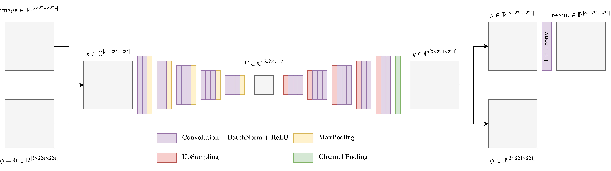

<!-- _paginate: skip -->

# Progress - March 28th

Complex Valued Autoencoders for Object Discovery

---

### Architecture (VGG16-based)

---

### Recap

-   CAE works for RGB images with channel pooling
    -   Resulting phases clustered closely together
    -   Cluster distances are minimal
-   Why are the clusters distances so small?
    -   Pixel darkness seems to play a role
    -   Investiage CAE response to "uniform" signals
-   Why are the phases clustered so thightly?
    -   Small maginitudes could play a role

---

### Black to White - Untrained

---

### Black to White - Trained

---

### Black to White - Analysis

-   Untrained model uniformally distributed
-   Trained model angles between 135 and 225
    -   Or: between $0.2\pi$ and $-0.2\pi$
-   Phase-normalization could prove helpful
    -   Next experiments

---

### Small magnitudes

-   Subtract $0.1$ from reconstruction
    -   Forces last convolutional layer bias to be $\gt 0.1$
    -   Forcing output maginutdes to be $\gt 0.1$
    -   Forcing phases to be more valuable

---

### Small magnitudes - Results

|  |  |
| :---------------------------------------: | :---------------------------------------: |
|                $MSE$ loss                 |           $\%$ of $\rho > 0.1$            |

---

### Small magnitudes - Results

-   Only effective in early stages of training
    -   Up to about $100.000$ datapoints

---

### Channel Difference Regularization

-   Completely fails to optimize

|  |  |  |
| :----------------------------------------: | :---------------------------------------: | :---------------------------------------: |
|                   Sample                   |              Reconstruction               |                  Phases                   |

