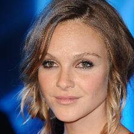
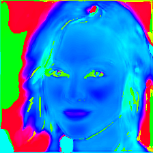
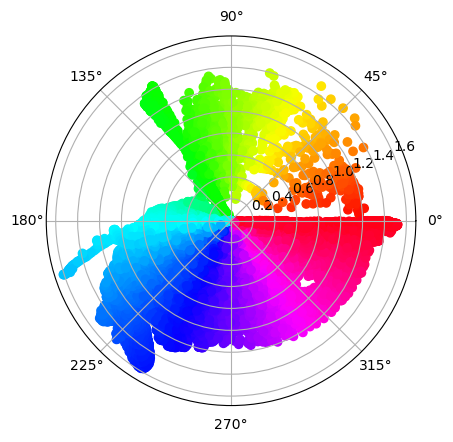
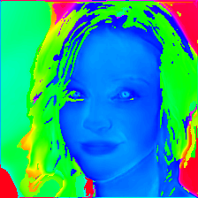
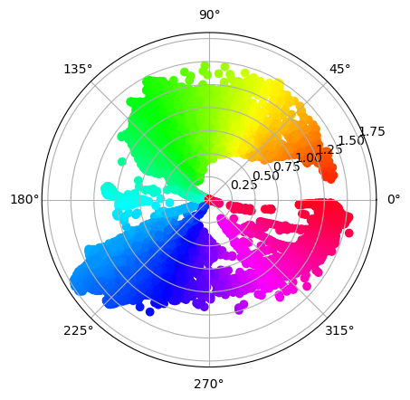
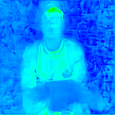
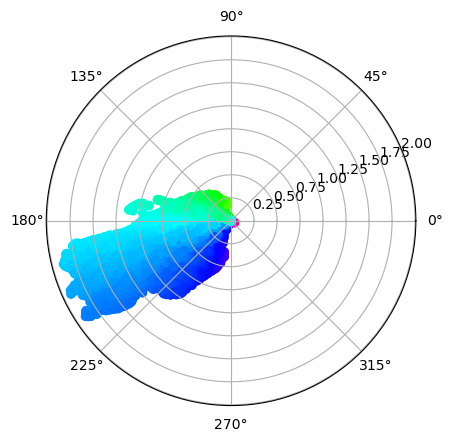
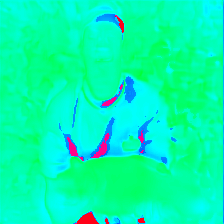
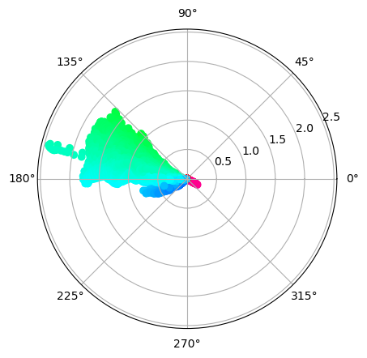

<!-- _paginate: skip -->

# Progress - April 3rd

Complex Valued Autoencoders for Object Discovery

---

### Recap

-   CAE works for RGB images with channel max-pooling
    -   Resulting phases clustered closely together
    -   Cluster distances are minimal
-   Still no answer to:
    -   Why are the clusters distances so small?
    -   Why are the phases clustered so thightly?
-   Quantative evaluation of CAE

---

### CLEVR Dataset

-   Very old tensorflow format
    -   Conversion took very long
    -   Training started today

---

### Testing Pooling Techniques

-   Channel max pooling produces sparse gradient
    -   Sparse optimization
    -   Softmax weighted average pooling
        -   Use softmax to obtain hardmax

---

### Weighted Average Pooling

|  |  |  |
| :------------------------------------------: | :-----------------------------------------: | :-----------------------------------------: |
|                    Sample                    |                   Phases                    |                    Polar                    |

---

### Softmax Weighted Pooling

|  |  |  |
| :------------------------------------------: | :-----------------------------------------: | :-----------------------------------------: |
|                    Sample                    |                   Phases                    |                    Polar                    |

---

### Weighted Average Pooling

|  |  |  |
| :-------------------------------------------: | :------------------------------------------: | :------------------------------------------: |
|                    Sample                     |                    Phases                    |                    Polar                     |

---

### Softmax Weighted Pooling

|  |  |  |
| :-------------------------------------------: | :------------------------------------------: | :------------------------------------------: |
|                    Sample                     |                    Phases                    |                    Polar                     |

---

### Hardmax Pooling

```python
# Magnitude softmax over channels
m_soft = softmax(m, dim=1) # (Optional)

# Create hard binary masks
m_hard_idx = argmax(m, dim=1)
m_hard = zeros_like(m_soft).scatter(1., m_hard_idx)

# Create hard mask with gradient
m_mask = m_hard - m_soft.detach() + m_soft

# Only keep phi for max(m)
phi = (phi * m_mask).sum(dim=1)
```

-   The resulting gradient is no longer sparse

<style>
    section {
        background: white;
    }

    h1, h2, h3, h4, h5 {
        color: #78588a;
    }

    ul {
        width: 100%;
        list-style: none;
    }

    ul li::before {
        content: "\2022";
        color: #6b32a8;
        font-weight: bold;
        display: inline-block;
        width: 1em;
        margin-left: -1em;
    }

    ul ul li::before {
        opacity: 0.5;
    }

    section::after {
        content: attr(data-marpit-pagination) '/' attr(data-marpit-pagination-total);
        background: None;
    }
</style>
