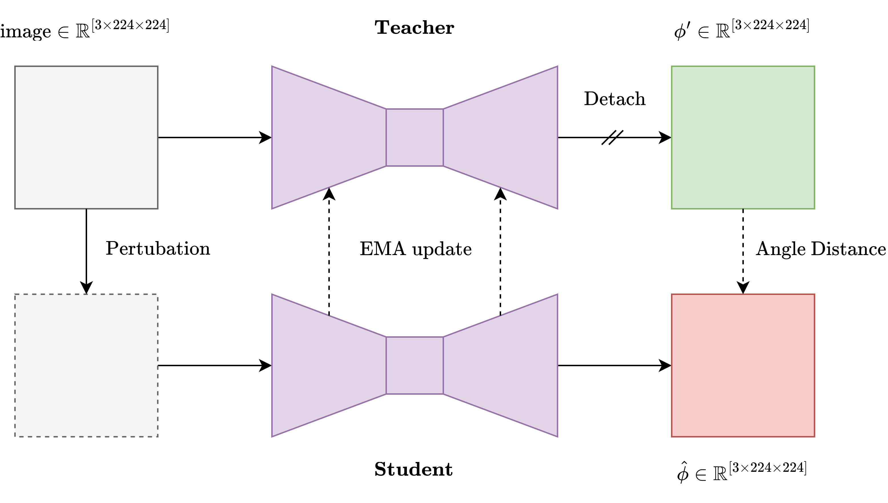

<!-- _paginate: skip -->

# Progress - April 10th

Complex Valued Autoencoders for Object Discovery

---

### Recap

-   Testing different pooling techniques
    -   Weighted average
    -   Softmax weighted average
    -   Gumbel softmax weighted average
-   Testing phase initialization
    -   Superpixels

---

### This Week

-   Code for ARI Evaluation on CLEVR dataset
-   Experiments with:
    -   Superpixel based phase initialization
    -   Hard forcing magnitude > 0.1
    -   Momentum encoder

---

### Superpixel Initialization

---

### Superpixel Initialization

|  |  |  |
| :--------------------------------------------: | :--------------------------------------------: | :--------------------------------------------: |
|                     Sample                     |                     Phases                     |                     Polar                      |

---

### Forcing Magnitude > 0.1

|  |  |  |
| :--------------------------------------------: | :--------------------------------------------: | :--------------------------------------------: |
|                     Sample                     |                     Phases                     |                     Polar                      |

---

### Momentum Encoder

---

### Momentum Encoder

|  |  |  |
| :--------------------------------------------: | :--------------------------------------------: | :--------------------------------------------: |
|                     Sample                     |                     Phases                     |                     Polar                      |

