<!-- _paginate: skip -->

# Progress - April 17th

Complex Valued Autoencoders for Object Discovery

---

### Recap

-   Testing phase initialization
    -   Superpixels
    -   Positional encoding
-   Testing momentum-based contrastive learning
    -   Different augmentations
-   Rendering matte only CLEVR dataset

---

### Architecture (VGG16-based)

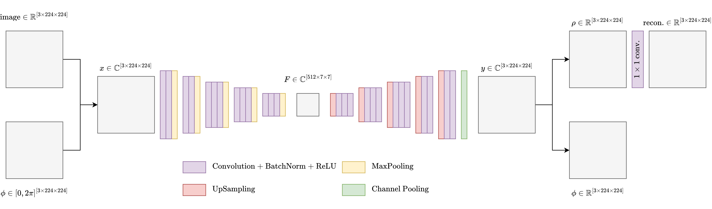

---

### Positional Phase Results - CLEVR

| 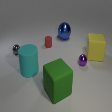 | 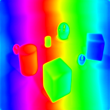 | 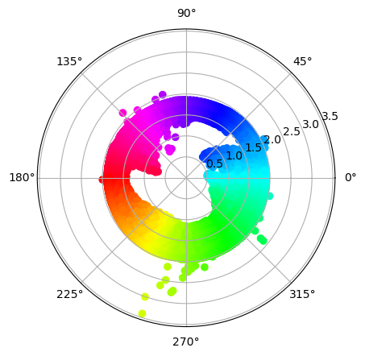 |
| :-----------------------------------------: | :--------------------------------------------: | :--------------------------------------------: |
|                   Sample                    |                     Phases                     |                     Polar                      |

---

### Positional Phase Results - CLEVR

|  | 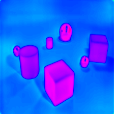 | 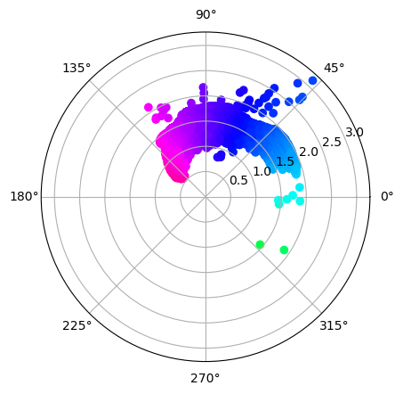 |
| :-----------------------------------------: | :-----------------------------------------: | :-----------------------------------------: |
|                   Sample                    |                   Phases                    |                    Polar                    |

---

### Positional Phase Results - Faces

|  | 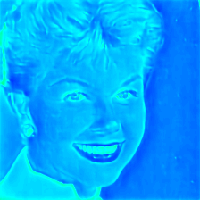 | 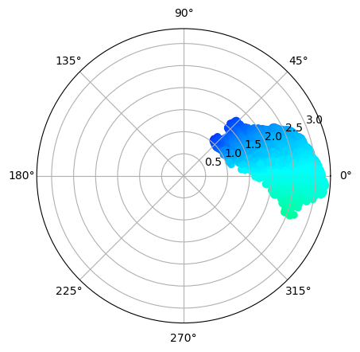 |
| :-----------------------------------------: | :-----------------------------------------: | :-----------------------------------------: |
|                   Sample                    |                   Phases                    |                    Polar                    |

---

### CLEVR - Comparison

| 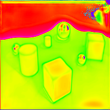 | 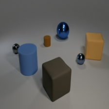 |  | 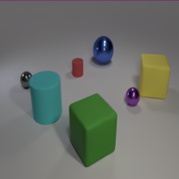 |
| :------------------------------------------------: | :------------------------------------------------: | :---------------------------------------------: | :---------------------------------------------: |
|                      0-Phase                       |                      0-Phase                       |                     P-Phase                     |                     P-Phase                     |

---

### CLEVR Training -> Faces Eval

| 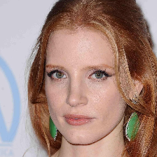 | 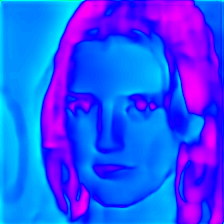 | 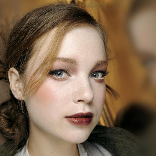 | 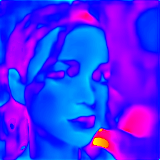 |
| :-------------------------------------------: | :-------------------------------------------: | :-------------------------------------------: | :-------------------------------------------: |
|                   Sample 1                    |                   Result 1                    |                   Sample 2                    |                   Result 2                    |

---

### CLEVR Training -> Cars Eval

| 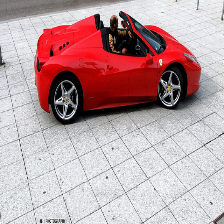 | 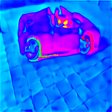 |  | 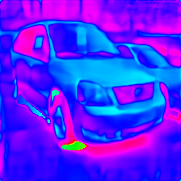 |
| :-------------------------------------------: | :-------------------------------------------: | :-------------------------------------------: | :-------------------------------------------: |
|                   Sample 1                    |                   Result 1                    |                   Sample 2                    |                   Result 2                    |

---

### Momentum-Based Contrastive

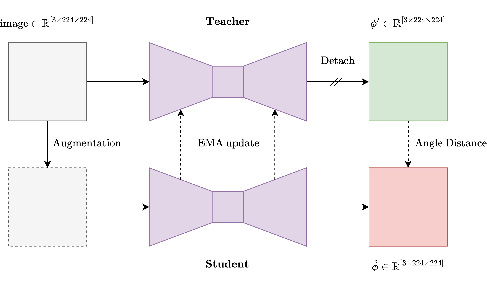

---

### Augmentations

-   2 teacher augmentations
-   8 student augmentations
-   Solarize, ColorJitter, Grayscale, GaussianBlur

---

### Results

|  | 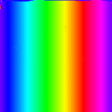 | 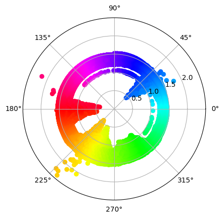 |
| :-----------------------------------------: | :--------------------------------------------: | :--------------------------------------------: |
|                   Sample                    |                     Phases                     |                     Polar                      |

---

### Next up

-   Contrastive approach
    -   Add crop to augmentation
    -   Add (histogram-based) discretization
        -   IOU matching instead of 1 to 1 pixel loss

