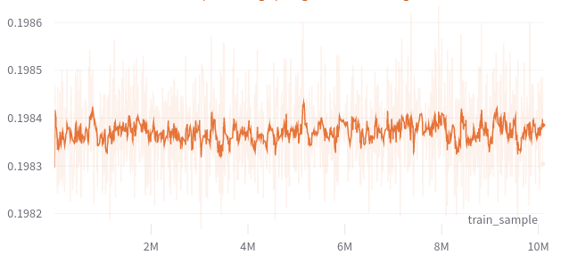

<!-- _paginate: skip -->

# Progress - April 25th

Complex Valued Autoencoders for Object Discovery

---

### Recap

-   Momentum-based contrastive learning
    -   Different augmentations
    -   Discretize segmentations

---

### Architecture (VGG16-based)


---

### Momentum-based Contrastive Learning


---

### Discrete Masks


```python
seg = einsum("bchw, bcs -> bshw", (bins, probs))
```

---

### MoCAE Discrete Masks - Results

|  |  |  |
| :--------------------------------------: | :--------------------------------------: | :--------------------------------------: |
|                  Sample                  |                  Phases                  |                  Polar                   |

---

### Discrete Masks BCE - Results



<style>
    section {
        background: white;
    }

    h1, h2, h3, h4, h5 {
        color: #78588a;
    }

    ul {
        width: 100%;
        list-style: none;
    }

    ul li::before {
        content: "\2022";
        color: #6b32a8;
        font-weight: bold;
        display: inline-block;
        width: 1em;
        margin-left: -1em;
    }

    ul ul li::before {
        opacity: 0.5;
    }

    section::after {
        content: attr(data-marpit-pagination) '/' attr(data-marpit-pagination-total);
        background: None;
    }
</style>
