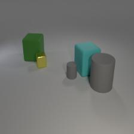
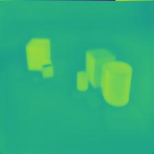
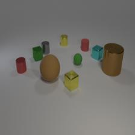
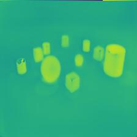
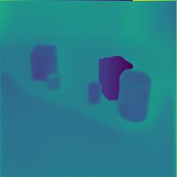
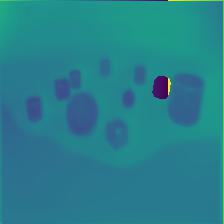
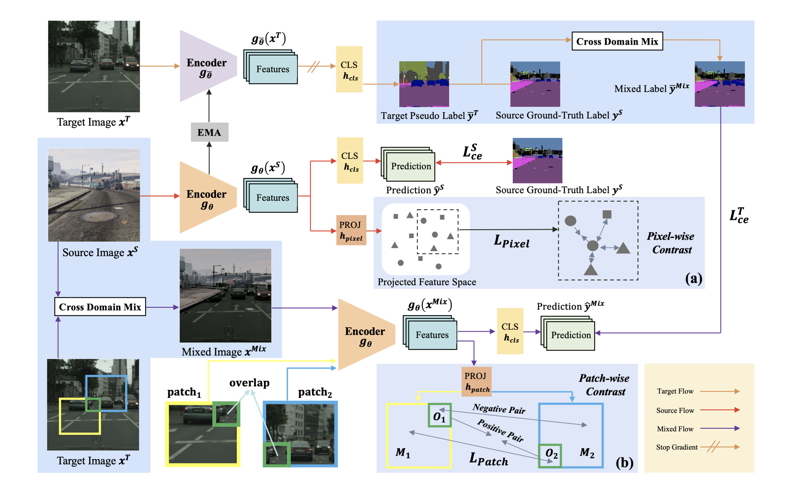

<!-- _paginate: skip -->

# Progress - May 23rd

Complex Valued Autoencoders for Object Discovery

---

### Recent Progress

-   Optimizing transforms/hyperparameters
-   Generating 500k CLEVR images
-   Re-thinking contrastive approach
    -   Literature research

---

### Overlapping Objects

-   Previous results

|  |  |  |  |
| :------------------------------------------: | :--------------------------------------------: | :------------------------------------------: | :--------------------------------------------: |
|                                              |                                                |                                              |                                                |

---

### Overlapping Objects

-   Current results

|  |  |  |  |
| :------------------------------------------: | :------------------------------------------: | :------------------------------------------: | :------------------------------------------: |
|                                              |                                              |                                              |                                              |

---

### PiPA - Chen et al.

