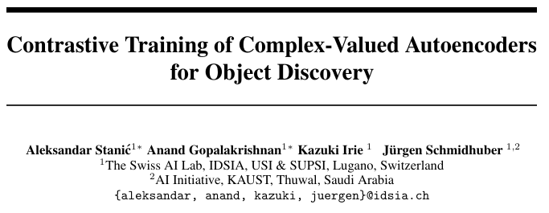
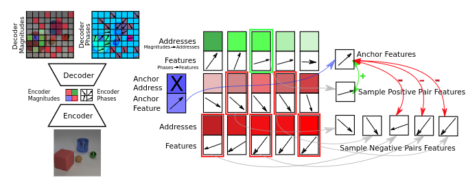
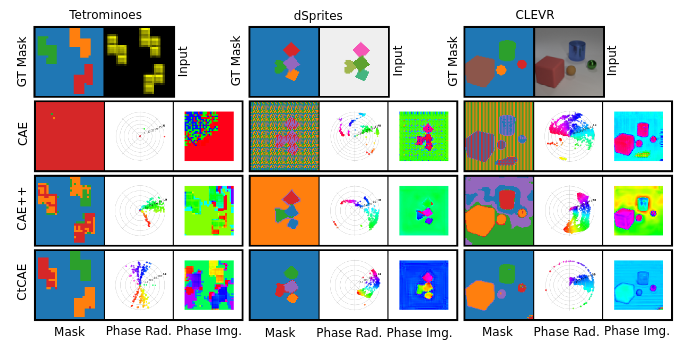
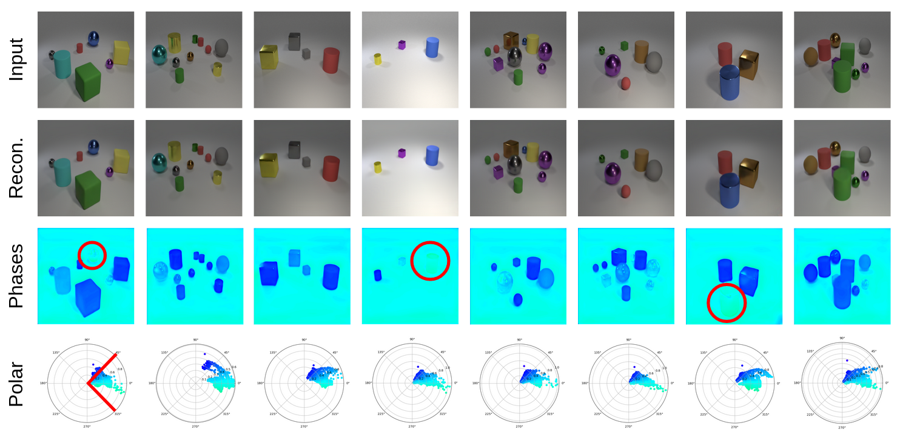
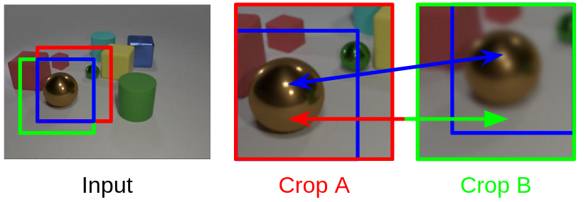
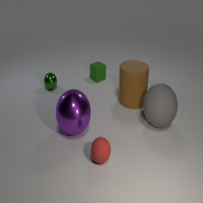
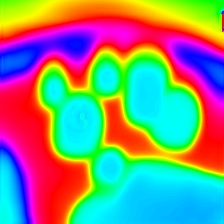
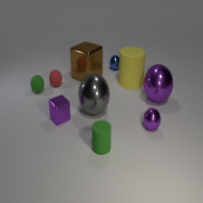
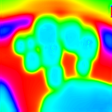

<!-- _paginate: skip -->

# Progress - June 7th

Complex Valued Autoencoders for Object Discovery

---

---

### Model Improvements

-   Also Upsampling
    -   No Deconvolution
-   No Image Rescaling Layer
    -   No Sigmoid
-   Channel Reduction not Specified

---

### Contrastive Approach

---

### Results

---

### Re-Creation

---

### Patch-based Contrast

---

### Results

|  |  |  |  |
| :------------------------------------------: | :------------------------------------------: | :------------------------------------------: | :------------------------------------------: |
|                                              |                                              |                                              |                                              |

