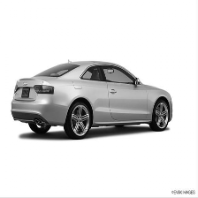
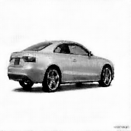
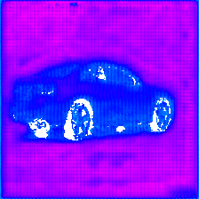
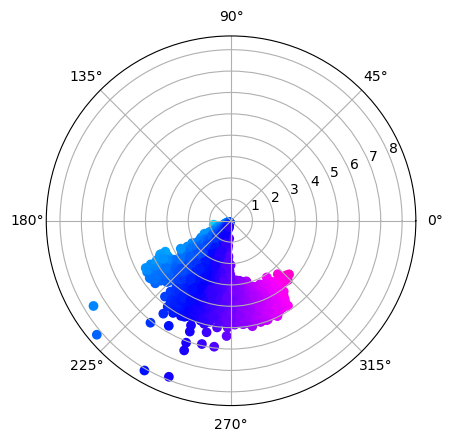
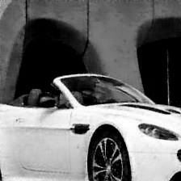
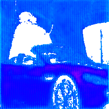
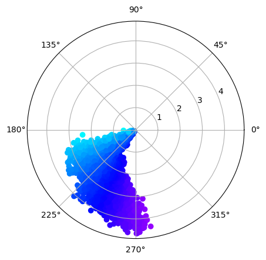

# Progress - January 30th

Complex Valued Autoencoders for Object Discovery

---

### Recap

-   Restructured existing codebase
-   Reproduction of existing results
-   Experimentation with CIFAR & ImageNet
    -   Larger model ⟶ better reconstruction
-   Improve phase assignments
    -   Patch-based contrastive learning
    -   Pretrained features for similarity matching

---

### Progress

-   Implementation of new layers
    -   `ComplexMaxPool2d`
    -   `ComplexUnmaxPool2d`
-   Implementation of VGG-16 based autoencoder
    -   Used in U-Net/SegNet for segmentation
    -   Configurable number of features
    -   Pretraining on StanfordCars
-   Implementation of patching & matching

---

### Stanford Cars - Example 1

|  |  |  |
| :-----------------------------------------: | :-----------------------------------------: | :-----------------------------------------: |
|                   Sample                    |               Reconstruction                |                   Phases                    |

---

### Stanford Cars - Example 1

|  |  |  |
| :-----------------------------------------: | :-----------------------------------------: | :-----------------------------------------: |
|                   Sample                    |               Reconstruction                |                   Phases                    |

---

### Stanford Cars - Example 2

|  |  |  |
| :-----------------------------------------: | :-----------------------------------------: | :-----------------------------------------: |
|                   Sample                    |               Reconstruction                |                   Phases                    |

---

### Stanford Cars - Example 2

|  |  |  |
| :-----------------------------------------: | :-----------------------------------------: | :-----------------------------------------: |
|                   Sample                    |               Reconstruction                |                   Phases                    |

---

### Additional Research

- FreeSOLO
    - FreeMask: Coarse mask extraction using learned features
    - SOLO refinment using self-training
        - Weak supervision loss on coarse masks
- CutLER
    - Very recent (few days ago) - still reading
    - ViT ⟶ MaskCut ⟶ Detector (self-training)
        - MaskCut outperforms FreeMask

---

# Next up

