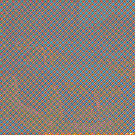
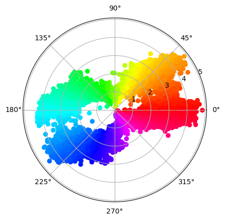
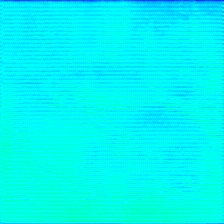
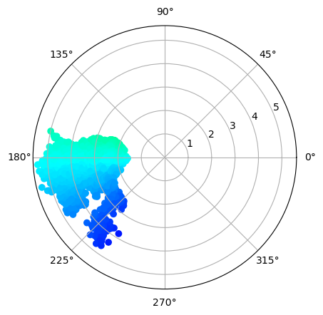

# Progress - Febuary 6th

Complex Valued Autoencoders for Object Discovery

---

### Challenges

-   Checkerboard pattern
    -   MaxUnpool > Upsample
    -   Local Contrast Reg.

---

### Challenges

-   Local Contrast Reg.
    -   Low variability

---

### Contrastive Learning

-   Patches > Learned mask
    -   Masked features
    -   Immediate clustering
    -   Unsupervised pre-training

