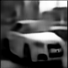

# Progress - Febuary 13th

Complex Valued Autoencoders for Object Discovery

---

### Progressive Growing

|  |  |  |
| :---------------------------------------: | :---------------------------------------: | :---------------------------------------: |
|                  Sample                   |              Reconstruction               |                  Phases                   |

---

### Progressive Growing

|  |  |  |
| :---------------------------------------: | :---------------------------------------: | :---------------------------------------: |
|                  Sample                   |                   Polar                   |                  Phases                   |

---

### Polar Interpolation and Pooling

-   Max(Un)Pooling on polar projection
-   Interpolation on polar projection

---

### Improved Clustering

-   Opening/Closing
-   Uniform kernel
-   Connected components

---

### Polar Interpolation

|  |  |  |
| :------------------------------------------: | :------------------------------------------: | :------------------------------------------: |
|                    Sample                    |                Reconstruction                |                    Phases                    |

---

### Polar Interpolation

|  |  |  |
| :------------------------------------------: | :------------------------------------------: | :------------------------------------------: |
|                    Sample                    |                    Polar                     |

---

### Polar Pooling

|  |  |  |
| :----------------------------------------: | :----------------------------------------: | :----------------------------------------: |
|                   Sample                   |               Reconstruction               |                   Phases                   |

---

### Polar Pooling

|  |  |  |
| :----------------------------------------: | :----------------------------------------: | :----------------------------------------: |
|                   Sample                   |                   Polar                    |                  Clusters                  |

---

### Contrastive Learning

-   Masked convolutions
    -   Partial convolution (Liu et al.)
-   Bipartite mask matching
    -   Mask IOU metric
-   Masked feature similarity
    -   Object centric representation

