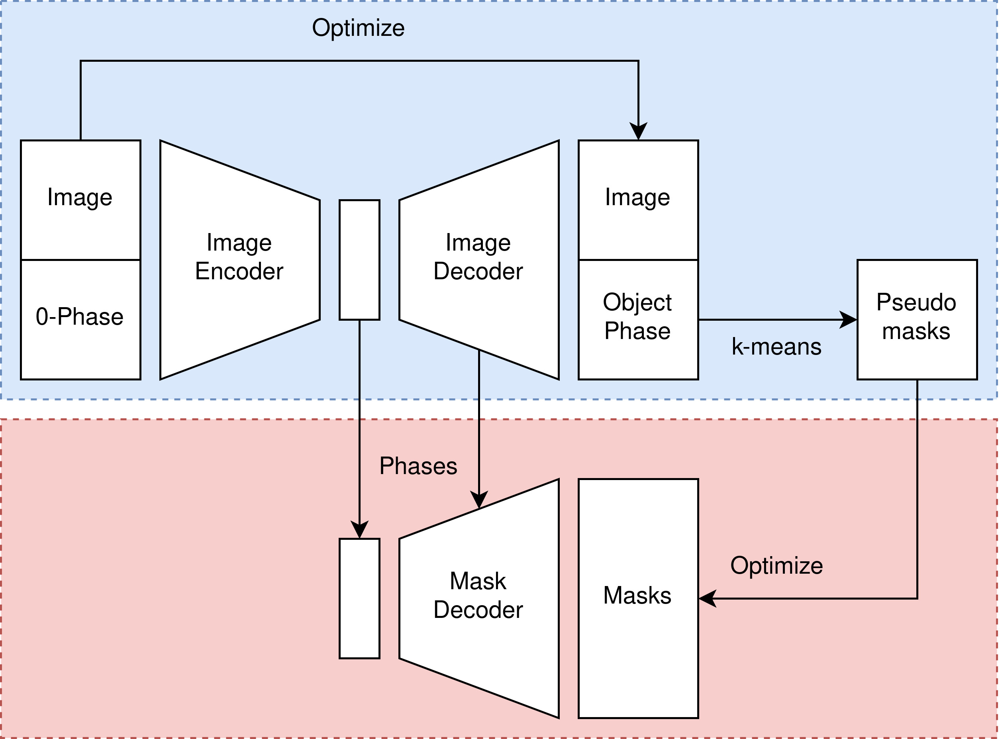
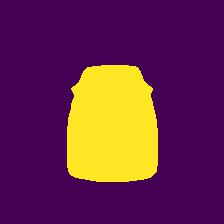
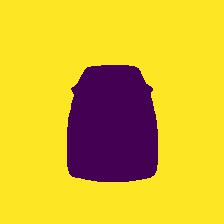
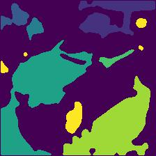
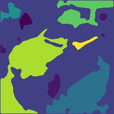
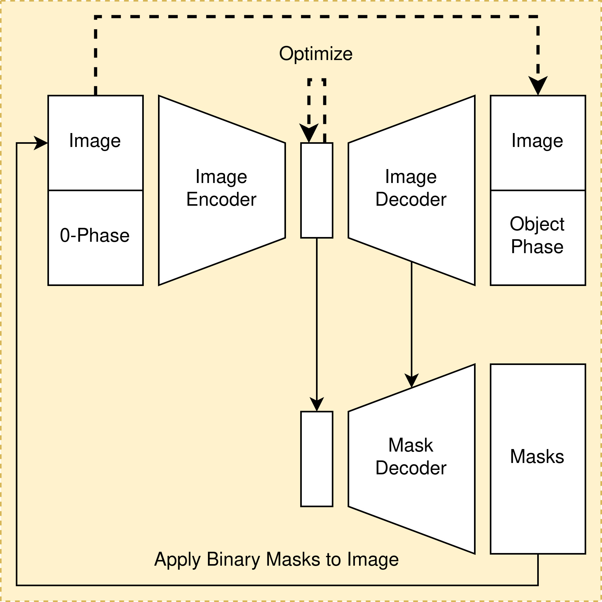

# Progress - Febuary 20th

Complex Valued Autoencoders for Object Discovery

---

### Mask Training

---

### Improved Pseudo Clustering

-   Connected components
-   Binary closing
-   Binary opening

---

### Mask Training

|  |  |  |
| :----------------------------------------: | :----------------------------------------: | :----------------------------------------: |
|                   Sample                   |                Pseudo-Masks                |               Decoded Masks                |

---

### Mask Training

|  |  |  |
| :----------------------------------------: | :----------------------------------------: | :----------------------------------------: |
|                   Sample                   |                Pseudo-Masks                |               Decoded Masks                |

---

### Next Stage: Latent Optimization

