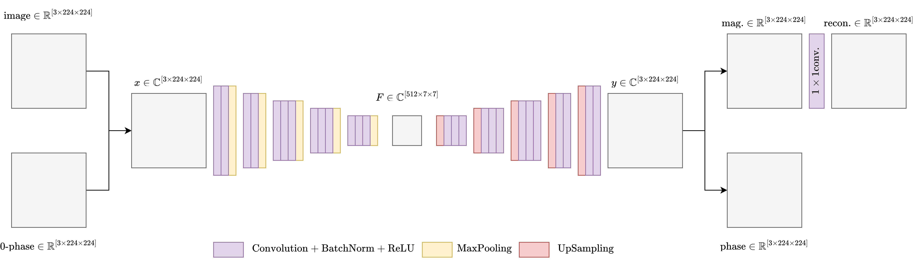
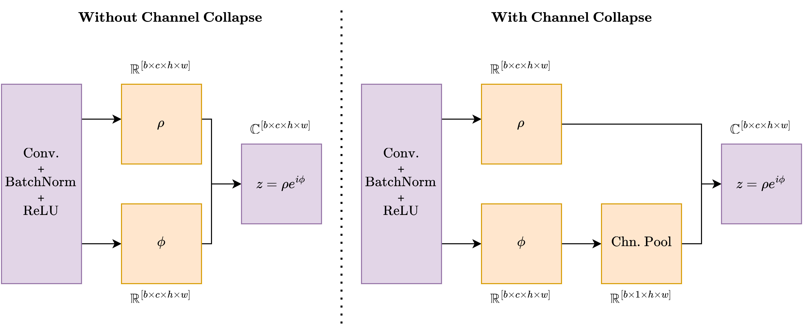
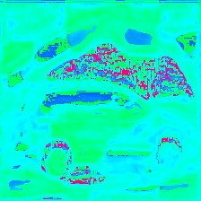
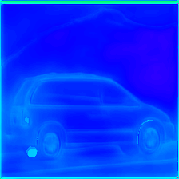
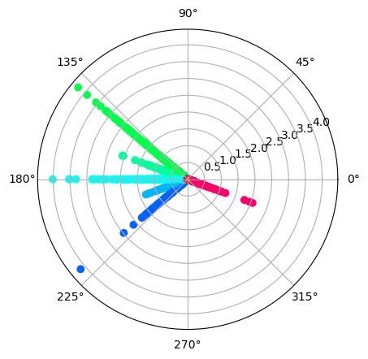
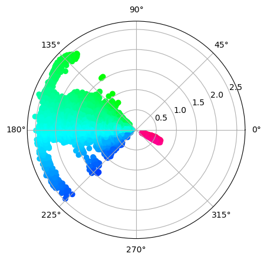
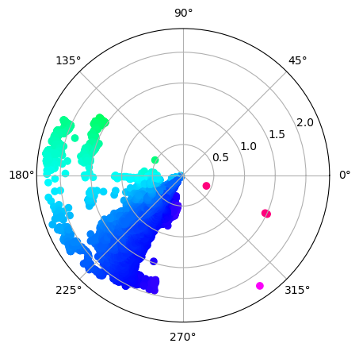

# Progress - March 6th

Complex Valued Autoencoders for Object Discovery

---

### Current Architecture (VGG16-based)

---

### Current Challenges - Recap

-   Moving towards RGB
    -   All encoding ends up in magnitude
    -   Elaborately described in paper
-   Some magnitudes are small

---

### RGB Images - Channel Collapse

-   Apply to all layers or only to the last layer

---

### RGB Images - Results

|  |  |  |
| :----------------------------------------: | :---------------------------------------------: | :----------------------------------------------: |
|                   Sample                   |                    All Layer                    |                    Last Layer                    |

---

### RGB Images - Results

|  |  |  |
| :----------------------------------------: | :---------------------------------------------: | :----------------------------------------------: |
|                   Sample                   |                    All Layer                    |                    Last Layer                    |

---

### RGB Images - Results

|  |  |  |
| :-----------------------------------------------: | :---------------------------------------------: | :----------------------------------------------: |
|                    No Collapse                    |                    All Layer                    |                    Last Layer                    |

---

### RGB Images - Next Steps

-   Channel Collapse
    -   Magnitude-based channel-pooling
    -   Forcing larger magnitudes

