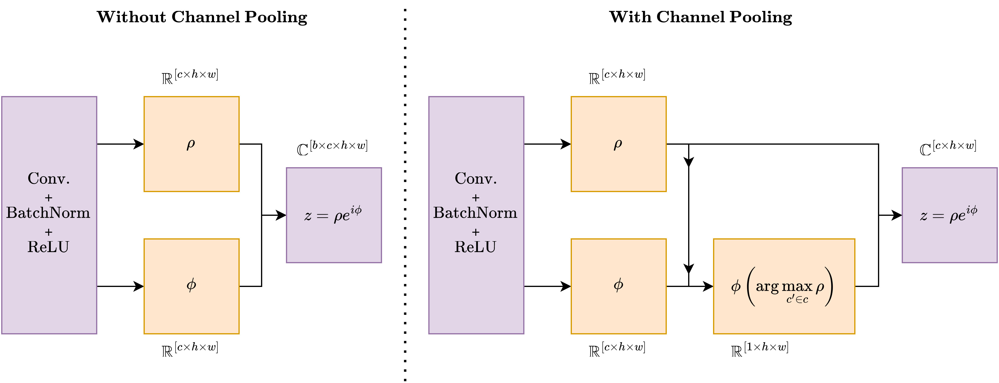
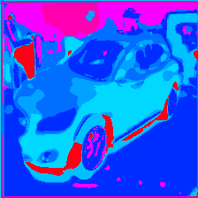
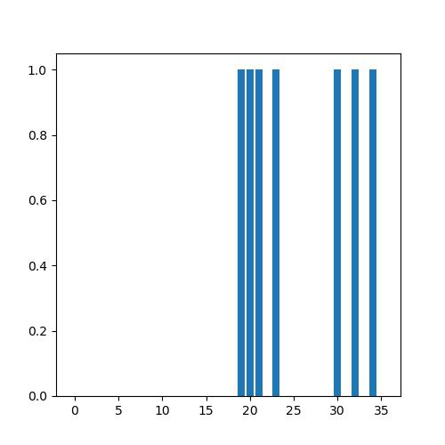

<!-- _paginate: skip -->

# Progress - March 13th

Complex Valued Autoencoders for Object Discovery

---

### Recap - Current Challenges

-   Working towards RGB images
    -   Original paper: phases become meaningless
-   Small magnitudes
    -   Original paper: apply masks

---

### Recap - Proposed Solutions

-   Channel pooling: take mean over channels
    -   Magnitude-based pooling
        -   Magnitude-max
        -   Forcing larger magnitudes

---

### Channel Pooling for RGB

---

### Architecture (VGG16-based)

---

### Magnitude MaxPooling Results

|  |  |  |
| :-----------------------------------------: | :-----------------------------------------: | :-----------------------------------------: |
|                   Sample                    |                   Phases                    |                    Polar                    |

---

### Magnitude MaxPooling Results

-   CAE produces meaningful phases for RGB images
-   CAE produces larger magnitudes
    -   Small magnitudes are implicitly penalized
    -   $\gt 90\%$ of magnitudes are $\gt 0.1$
        ($0.1 =$ Mask threshold in original paper)

---

### Clustering Update

-   Clustering becomes more trivial
    -   All information encoded in phases
        -   Projection to eucledian space not necessary
        -   K-Means not necessary
    -   Apply histogram to phases directly
        -   Number of bins = number of clusters
        -   Better clustering resolution control
        -   K is more dynamic

---

### Clustering Update

|  |  |  |
| :-----------------------------------------: | :-----------------------------------------: | :------------------------------------------: |
|                   Sample                    |                   Phases                    |                     Bins                     |

---

### Clustering Update

-   Only classify which bins are "active"
    -   $k \times 224 \times 224$ to just $k$
    -   Histogram approximation maintains gradient
        -   Enables direct contrastive optimization
        -   Push bins away from each other

