<!-- _paginate: skip -->

# Progress - March 20th

Complex Valued Autoencoders for Object Discovery

---

### Recap - Current Challenges

-   Working towards RGB images
    -   Original paper: phases become meaningless
-   Small magnitudes
    -   Original paper: apply masks

---

### Recap - Proposed Solutions

-   Channel pooling: take mean over channels
    -   Magnitude-based pooling
        -   Magnitude-max
        -   Forcing larger magnitudes

---

### Channel Pooling for RGB

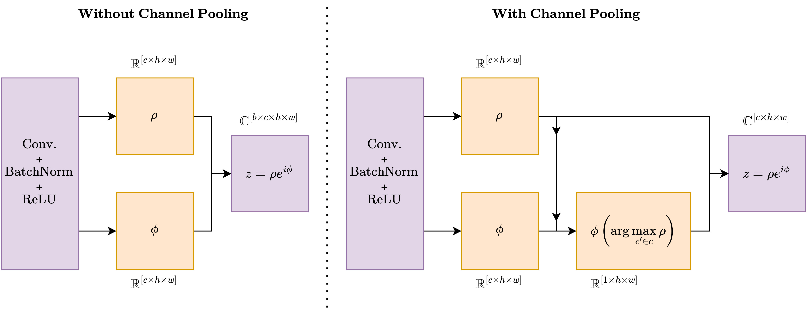

---

### Architecture (VGG16-based)

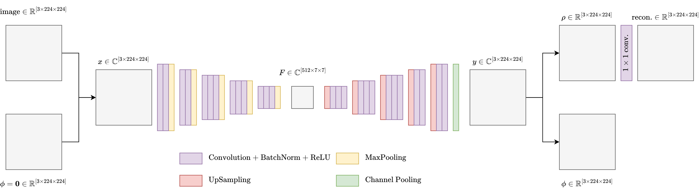

---

### Magnitude MaxPooling Results

| 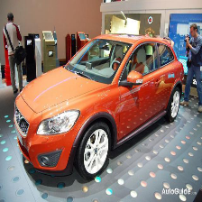 | 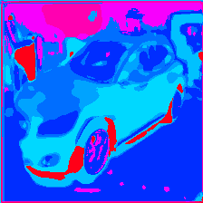 | 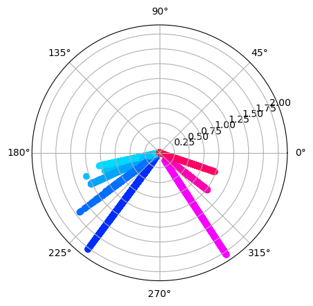 |
| :-----------------------------------------: | :-----------------------------------------: | :-----------------------------------------: |
|                   Sample                    |                   Phases                    |                    Polar                    |

---

### Magnitude MaxPooling Results

-   CAE produces meaningful phases for RGB images
-   CAE produces larger magnitudes
    -   Small magnitudes are implicitly penalized
    -   $\gt 90\%$ of magnitudes are $\gt 0.1$
        ($0.1 =$ Mask threshold in original paper)

---

### Clustering Update

-   Clustering becomes more trivial
    -   All information encoded in phases
        -   Projection to eucledian space not necessary
        -   K-Means not necessary
    -   Apply histogram to phases directly
        -   Number of bins = number of clusters
        -   Better clustering resolution control
        -   K is more dynamic

---

### Clustering Update

|  |  | 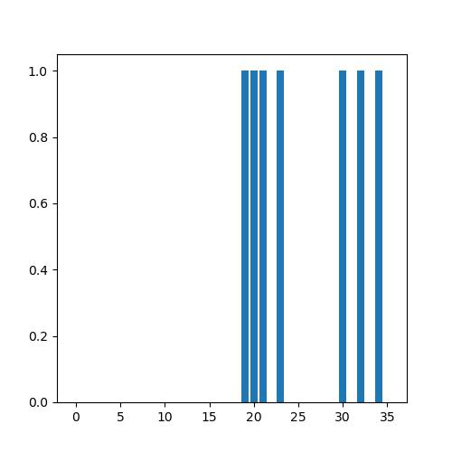 |
| :-----------------------------------------: | :-----------------------------------------: | :------------------------------------------: |
|                   Sample                    |                   Phases                    |                     Bins                     |

---

### Clustering Update

-   Only classify which bins are "active"
    -   $k \times 224 \times 224$ to just $k$
    -   Histogram approximation maintains gradient
        -   Enables direct contrastive optimization
        -   Push bins away from each other

---

### Histogram-based Contrastive Learning

-   Push distance (angle) between "active" bins
    -   Collapses to few bin

---

### CelabA-HQ-Mask Dataset

-   Segmentations provided
-   $2 \times$ the number of images

---

### CelabA-HQ-Mask Results #1

| 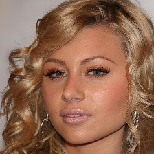 | 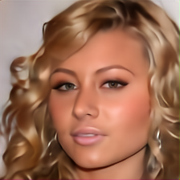 | 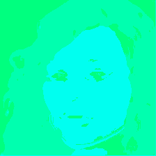 |
| :-------------------------------------------: | :-------------------------------------------: | :-------------------------------------------: |
|                    Sample                     |                Reconstruction                 |                    Phases                     |

---

### CelabA-HQ-Mask Results #1

|  |  | 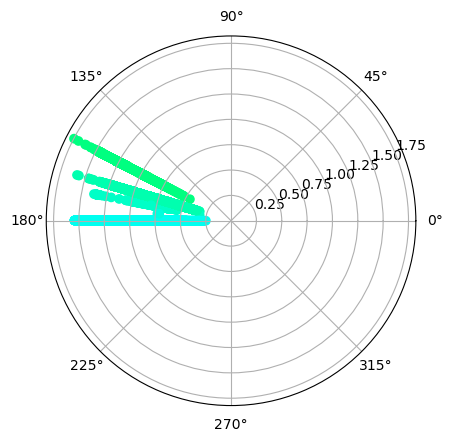 |
| :-------------------------------------------: | :-------------------------------------------: | :-------------------------------------------: |
|                    Sample                     |                    Phases                     |                     Polar                     |

---

### CelabA-HQ-Mask Results #2

| 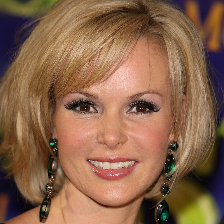 |  | 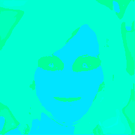 |
| :-------------------------------------------: | :-------------------------------------------: | :-------------------------------------------: |
|                    Sample                     |                Reconstruction                 |                    Phases                     |

---

### CelabA-HQ-Mask Results #2

|  |  | 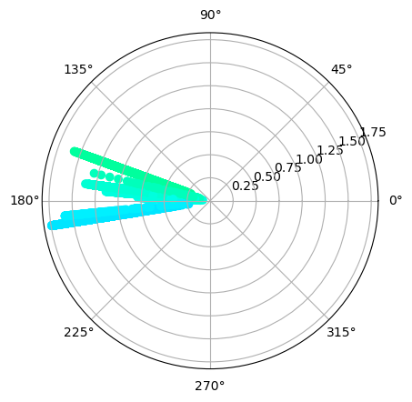 |
| :-------------------------------------------: | :-------------------------------------------: | :-------------------------------------------: |
|                    Sample                     |                    Phases                     |                     Polar                     |

---

### Histogram Count Maximization

-   With histogram-based clustering
    -   Less need for angle distance
    -   More control over "super-pixel" size
    -   Apply area size loss to histogram bins

